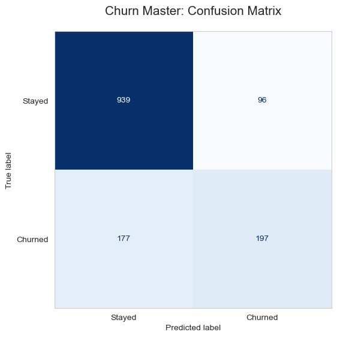

# Telco-Customer-Churn-Prediction | EDA-ML-Pipeline 📊

> **An end-to-end Machine Learning project to predict customer churn using Python. Includes Exploratory Data Analysis (EDA), data preprocessing, and classification modeling to improve retention strategies.**

---

## 🎯 Project Overview
This project aims to identify key factors that lead to customer attrition and build a predictive model to help businesses take proactive retention measures.

## 📈 Model Performance

  
   
  <i><b>Figure 1:</b> Confusion Matrix showing how accurately the model identifies churners.</i>

---

## 🛠️ Tools & Technologies
* **Language:** Python
* **Libraries:** Pandas, NumPy, Scikit-learn, Matplotlib, Seaborn
* **Platform:** Kaggle & GitHub

## 🚀 How to Use
1. Clone the repository.
2. Run the `Customer_Churn.ipynb` notebook.
3. Use the visualizations in the `images/` folder for reporting.

---
### Let's Connect!
[Nosheen Khan on LinkedIn](https://www.linkedin.com/in/khannosheen)
