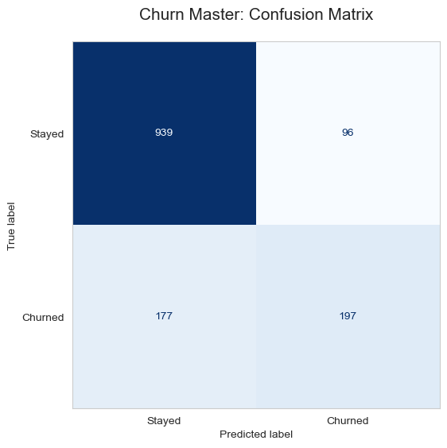

# Telco-Customer-Churn-Prediction | EDA-ML-Pipeline 📊

> **An end-to-end Machine Learning project to predict customer churn using Python. Includes Exploratory Data Analysis (EDA), data preprocessing, and classification modeling to improve retention strategies.**

---

## 🎯 Project Overview
This project aims to identify key factors that lead to customer attrition and build a predictive model to help businesses take proactive retention measures.

## 📈 Model Performance

  
   
  <i><b>Figure 1:</b> Confusion Matrix showing how accurately the model identifies churners.</i>

---

## 🛠️ Tools & Technologies
* **Language:** Python
* **Libraries:** Pandas, NumPy, Scikit-learn, Matplotlib, Seaborn
* **Platform:** Kaggle & GitHub

## 🚀 How to Use
1. Clone the repository.
2. Run the `Customer_Churn.ipynb` notebook.
3. Use the visualizations in the `images/` folder for reporting.

## 📊 Power BI Dashboard: Business Intelligence Layer

To bridge the gap between model predictions and business strategy, I developed a two-page interactive dashboard. This allows stakeholders to explore the churn drivers identified by the CatBoost model in a dynamic environment.

### **Key Features:**
* **End-to-End Integration:** Visualizes the outputs and feature importance derived from the Python-based machine learning pipeline.
* **Executive Overview:** Provides high-level KPIs including total revenue at risk and overall churn rates.
* **Dynamic Deep Dive:** Includes functional slicers for payment methods and contract types, with a global reset feature (clicking empty space) for easy navigation.
* **Data Clarity:** Key fields have been professionally renamed (e.g., **Customer ID**) to ensure technical accuracy for stakeholders.

### **Dashboard Preview:**

  
   
  <em>Page 1: Executive Churn & Revenue Overview</em>

  
   
  <em>Page 2: Customer Risk & Service Deep Dive</em>

---
### Let's Connect!
[Nosheen Khan on LinkedIn](https://www.linkedin.com/in/khannosheen) | [Nosheen Khan on Kaggle](https://www.kaggle.com/nosheenkhan)
